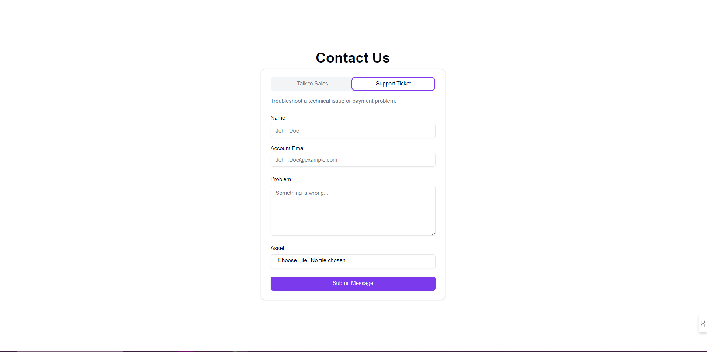
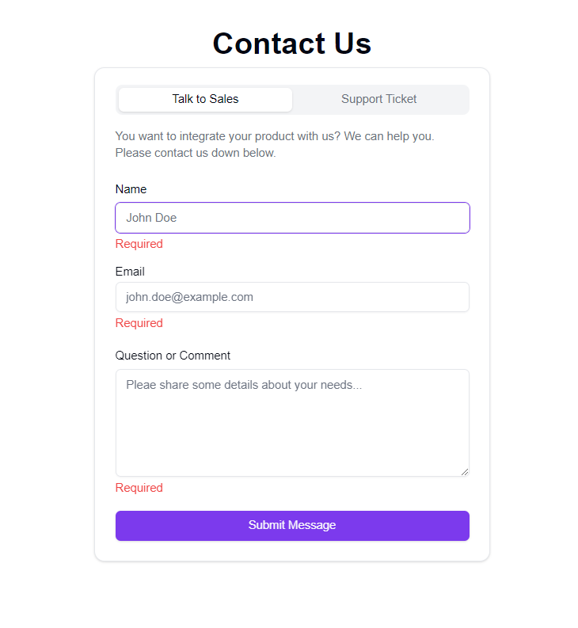

# Next.js Project

This is a [Next.js](https://nextjs.org) project bootstrapped with [`create-next-app`](https://nextjs.org/docs/app/api-reference/cli/create-next-app).

## Preview:

<!--  -->


## Tech Stack:

- **Next.js**: The core framework for building the front-end of this project.
- **Shadcn UI**: Used for styling and UI components, providing a modern and responsive design.
- **Server Actions**: Employed for handling server-side logic and validations, enhancing the overall performance by reducing API calls.
- **Zod**: Integrated for schema validation, ensuring that form data is validated both on the server and the client.
- **Conform**: Used for managing form validation and error handling in a declarative manner, simplifying complex form logic.
- **getForm**: A headless form backend that powers form submissions, providing a seamless user experience with server-side validation and management.

## Installation:

To install and run the project locally:

1. Clone the repository
2. Install the dependencies:
  ```bash
  npm install
  ```

3. Run the development server:
```bash
npm run dev
# or
yarn dev
# or
pnpm dev
# or
bun dev
```

4. Open [http://localhost:3000](http://localhost:3000) with your browser to see the result.


